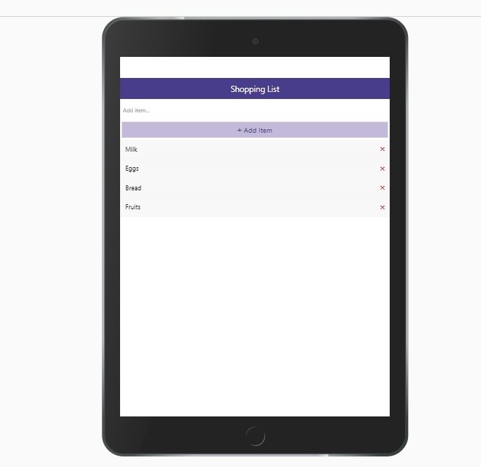

**Coding a very simple React-Native app through Expo platform**

 

> First use of React-Native components like: View, StyleSheet, TouchableOpacity, Alert or FlatList
>
> Playing with icons from library @expo/vector-icons
>
> Testing mobile rendering with Expo App

 

Thx to [Traversy Media](https://www.youtube.com/watch?v=Hf4MJH0jDb4) 😉

 

